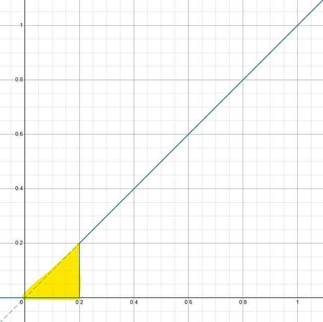

# Precision Control

<hr>

## Introduction

What is the most important part of an FRC team?  There are so many key aspects that there is no single answer.  However, most people would agree that the driver(s) plays a vital role in a team's success.  It is _essential_ that the driver is able to control his/her robot with maximum precision.  _This can not be stressed enough_.  What can we do with software to aid the driver?

Often overlooked yet glaringly obvious is also what is right in your hands: the controller joysticks.

Manipulating joystick inputs effectively can:

- Prevent driver overshoot
- Enhance micro-adjustment accuracy and control
- Customize the 'feel' for the user

<hr>

## Deadzones

Every controller is an imperfect device.  Due to hardware imperfections at the microscopic scale, when a joystick returns to the neutral position, the joystick _more than likely_ does not map to exactly `0.0` input.  So, it is common to have a 'deadzone' (also called a 'deadband'), where any input less than the deadzone is mapped to zero.  Here is some naive pseudocode with a 20% deadzone:

```java
double user_input = controller.getRightX();

if(user_input < 0.2){
    user_input = 0;
}
```

If you were to graph this pseudocode:

<br>

<div style="text-align:center">


</div>

<br>

The area highlighted in yellow is the input where precision control is lost.  This poses an issue; **the user is limited to a minimum input of 20%!** If used for the drivetrain, this will lead to driver overshoot, and in general inhibits the user's ability to make fine precision adjustments that are critical for game-piece acquisition or scoring opportunities.

You might object:

> "A 20% deadzone is huge!  Our team only uses a 5% deadzone!  This is a non-issue."

Even with a small deadzone, say 10% (something more typical), precision is limited.  In reality, we need a _better_ algorithm that is more generic.

What we really want is something more like this:

<div style="text-align:center">


</div>

<br>

The orange line is a linear interpolation of the blue line.  With a range range check on the linear interpolation, we can achieve the effect of a deadzone _without_ sacrificing precision.

<hr>

## Response Curves

Response curves are functions that will vary output magnitude based on a linear input.  Response curves allow one to customize the 'feel' of a joystick.  In general, the most applicable response curves, specifically for drivetrains, are exponential.  This is because they reduce input on the low end, allowing a user to more easily make micro-adjustments, and accelerate the input towards the high end, so that maximum output is not inhibited.  Some exponential curves are shown below: 

<br>

<div style="text-align:center">


</div>

<br>

A response curve in combination with a deadzone is _extremely_ effective.  One can simultaneously ignore hardware imperfections and enhance micro-adjustment capability.

<hr>
